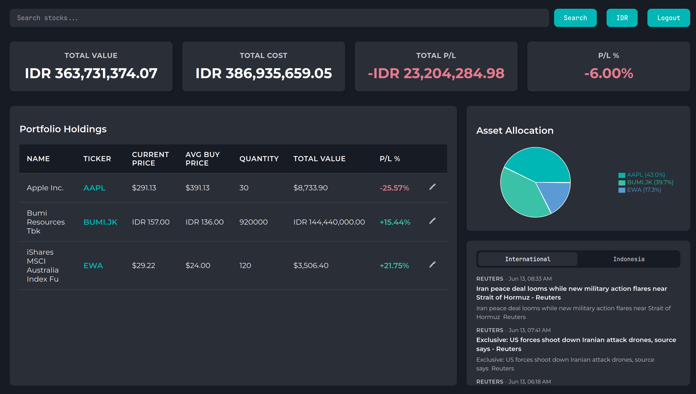
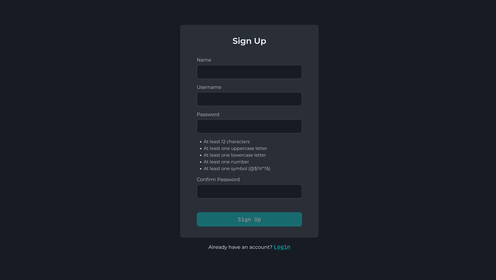

import Callout from '../../components/Callout.astro';

<Callout type="info">
  **Heads up!** Use laptop for the best user experience.
</Callout>

## Features
- Search and add stocks to holdings.
- Edit stock holdings dynamically.
- Summary of total cost, value, and profit/loss.
- Toggle and change the currency on the portfolio summary.
- Visual breakdown of stock allocation compared to total stock held.
- Integrated feed fetching international news and Indonesian market news.
- Automatically adds currency options when a user adds a stock from that specific region.

## Reason it's made
I was using multiple apps to track my investments—one for Indonesian stocks and another for US stocks. While it worked okay, I wanted a unified view of everything I owned in one place. I also wanted to glance at the daily news whenever I checked my holdings. 

Another major annoyance was that current tracking apps use different currencies for their summaries. This app exists so I can normalize my multi-currency assets and have everything I need right in a single dashboard.

## Structure
- **Database:** MongoDB (hosted via MongoDB Atlas).
- **Backend:** Express.js handling robust REST API endpoints structured cleanly with routers.
- **Frontend:** React.js. Server state (stock data, fetching, and caching) is managed entirely with React Query using a one-hour stale time to prevent hitting API limits. Client-side state (like currency toggles and user authentication state) is handled globally via Zustand.
- **Authentication:** JSON Web Tokens (JWT). Tokens are issued upon login and validated via custom middleware on every protected API route. Passwords are hashed with bcrypt before storage. The auth flow stores the token through cookie and rehydrates it on page load so sessions persist across browser refreshes.
- **Security:** 
    - Rate limitting for login and signup forms. 15 minutes time window per IP, 10 allowed request per window per IP. Using express-rate-limitter.
    - Input sanitization for ticker input and username sign up input.
    - To prevent IDOR vulnerabilities, route protection strictly enforces asset ownership verification.

## Images

